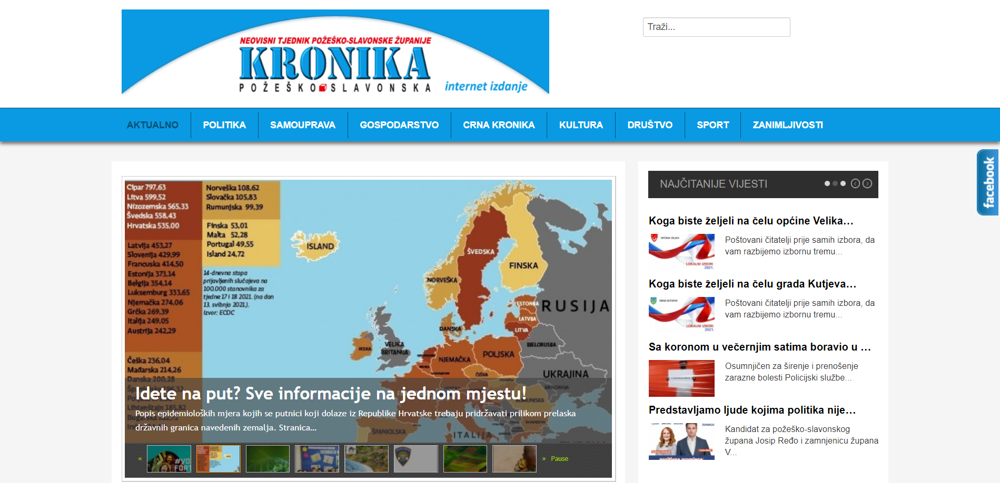

# __Covid 19 in media__

This project was made as a part of a course called Knowledge Management. 

<b>Faculty:</b> Department of Informatics, University of Rijeka

<b>Author:</b>
* Lucija Veljačić
  
<b>Mentor:</b>
* izv. prof. dr. sc. Ana Meštrović
  
<b>Programming language:</b> Python 3

## Description

The purpose of this project is to analyze data collected from a Croatian web portal  [Požeška kronika](https://pozeska-kronika.hr) and to generate new knowledge based on this data.

The __first part__ of the project focuses on collecting and cleaning data from the web portal. After scraping, the data is saved to a .csv file for future use in the second part of the project.

The goal of the __second part__ of the project is to analyze the collected data in regards to the current pandemic of Covid-19.  The analysis of the articles provided an insight into the presence of Covid-19 in the media.

  
### Požeška kronika - Homepage

 

### Technical information

__OS:__ Windows 10

__Tools and software:__
* PyCharm
* Python 3.8

## Phase 1 - Web scraping

 
