# __Covid 19 in media__

This project was created as a part of the course called Knowledge Management (Upravljanje znanjem). 

<b>Faculty:</b> Department of Informatics, University of Rijeka

<b>Author:</b> Lucija Veljačić
  
<b>Mentor:</b> izv. prof. dr. sc. Ana Meštrović
  
<b>Programming language:</b> Python 3

## Description

The purpose of this project is to analyse data collected from a Croatian web portal  [Požeška kronika](https://pozeska-kronika.hr) and to generate new knowledge based on this data.

The __first part__ of the project focuses on collecting and cleaning data from the web portal. After scraping, the data is saved to a .csv file for future use in the second part of the project.

The goal of the __second part__ of the project is to analyse the collected data in regards to the current pandemic of Covid-19.  The analysis of the articles provided an insight into the presence of Covid-19 in the media.

  
### Požeška kronika - Homepage

 

### Technical information

__OS:__ Windows 10

__Tools and software:__
* PyCharm
* Python 3.8

__Packages:__
* requests (2.25.1)
* bs4 (0.0.1)
* regex (2021.4.4)
* pandas (1.2.4)
* tabulate (0.8.9)
* matplotlib (3.4.2)
* nltk (3.6.2)
* wordcloud (1.8.1)

## Phase 1 - Web scraping

### Script __UPZ_PK0.py__

The script collects unique URLs from the web portal for the period from __1.1.2020. to 30.11.2020.__ and stores them in the file __url_list.txt__.

Web portal has __8 categories__:
* Economy
* Politics
* Self-government
* Crime&Accidents
* Culture
* Society
* Sport
* Interesting facts

Function __get_links__ is called for each category of the portal separately and it goes through pages containing the short overview of the articles (10 articles per page), starting from the newest page and stopping when it finds an article written before 1.1.2020. For a URL to be stored in the list of URLs, it must meet the condition that it is from 2020 and that it was not written in December, since the analysis is performed until the end of November. The final list of URLs has 2433 records. 

When executing the code, the script prints the number of pages it has opened for each category and the number of articles from the page that meet the condition of being published between 1.1.2020. and 30.11.2020. It also prints the total number of URLs after each page and the current category, and prints it. 

### Script __UPZ_PK1.py__

The next script __UPZ_PK1.py__ uses a previously created file storing URLs to get the list of URLs. The script opens each URL and scrapes the article ID, URL, title, category, date, day, and time of publishing, as well as article text and number of votes (number of people who reacted to the article).

Collected data and corresponding headers are stored in a file __podaci.csv__.  Initially, only the headers are stored, and then the data for each article is stored separately, as a row, as the script goes through the list of URLs. At the end, the data from the .csv file is read and stored to a .json file with the same name.

The format of the collected data can be seen in the following image.

 

## Phase 2 - Analysis

The goal of the Phase 2 is to to analyse the data in regards to the current pandemic of Covid-19. In other words, to see how often and when the articles mentioned the pandemic.

### Script __UPZ_PK2.1.py__

This script quantifies the number of Covid-related articles and visualizes the data.

In order to find the articles that mention Covid-19, it was necessary to create a list of keywords. Chosen words are:

* korona, koronavirus, koronavirusa, Covid, Covid, cjepivo, cjepiva, epidemija, epidemiolozi, epidemiolog, pandemija, Beroš, Capak, Markotić, samoizolacija, karantena, lockdown

The script reads the data from __podaci.csv__ into a DataFrame and after that it checks whether one of the keywords is mentioned either in the title or the text of each article. Only the records (articles) containing one of the keywords are kept in the DataFrame and stored in the file __korona_podaci.csv__. Additionally, the script creates another .txt file, __url_covid.txt__, containing only the URLs of the Covid-related articles. The script calculates the total number of articles and Covid-related articles and creates a Pie Chart showing the share of Covid-related articles in the total number articles, as shown in the images below. 

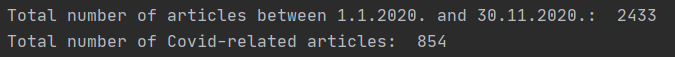

 

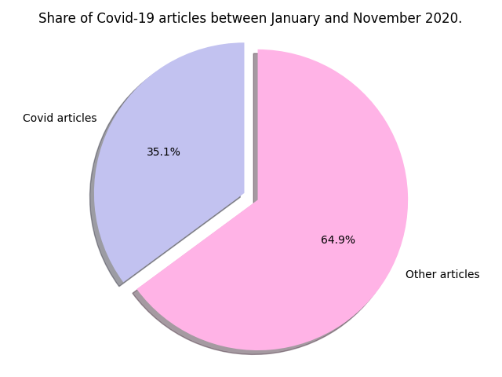

 

It is visible from the Pie Chart that a little bit over 1/3 (35,1%) of the articles in the given period of time mentioned Covid-19.

Additional analyses were conducted to compare the share of Covid articles during a particular day, month, or within a web portal category.

__Daily__

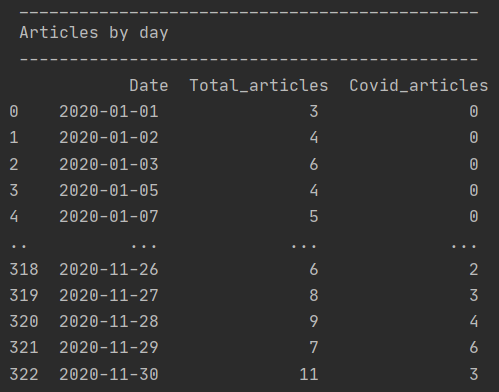

 

__Monthly__

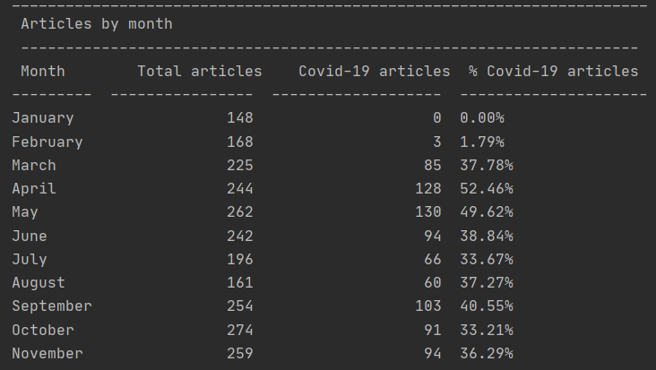

 

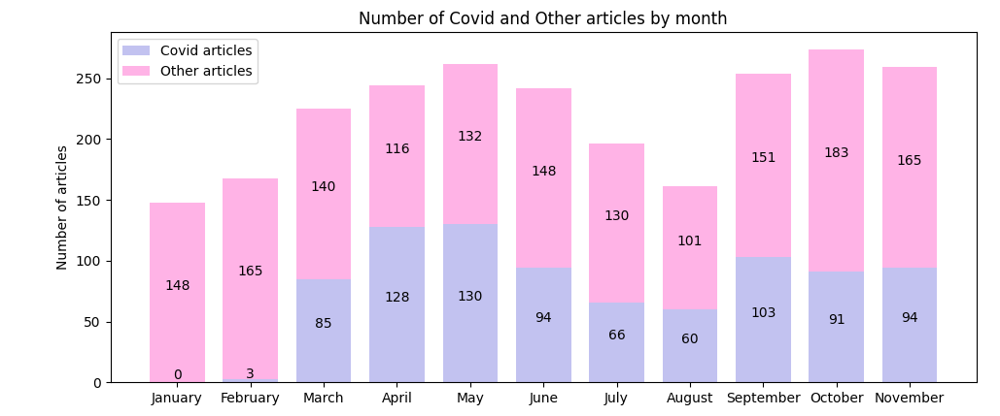

 

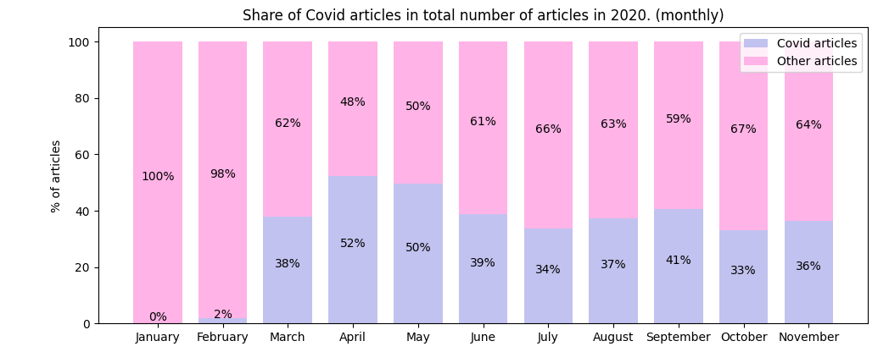

 

The analysis shows that there were no Covid-related news in January, which was expected, as the pandemic was just starting at the time, and was concentrated in China. During the peak of pandemic and lockdowns in Europe, in April and May, as much as 50% of the articles mentioned Covid. After that, the share of Covid articles became a bit lower and stayed consistant at around 35% throughout the rest of the year.

__By Category__

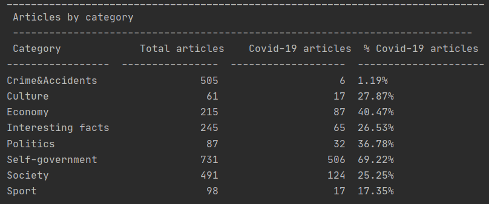

 

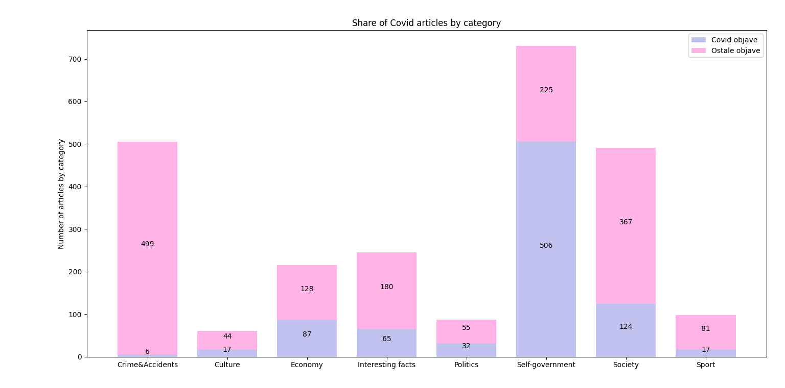

 

It's interesting that the smallest share of Covid-19 articles, a little over 1%, are found within a category Crimes&Accidents, which normally contains all the tragic news, such as news abouth deaths and similar.

### Script __UPZ_PK2.2.py__

The last script of the second phase of the project refers to the analysis of the language discourse used on the portal. It analyses the terms used in Covid-related articles.

The script reads the text of the Covid-related articles from the file __korona_podaci.csv__ and saves it to a separate file __analysis.csv__. Additionally, it creates a .txt file __all_words.txt__ containing all the words from all those texts, but without any special signs.

In order to properly analyse the language discourse, it is necessary to exclude stopwords, words that do not add much meaning to a sentence. They are contained in the file __stopwords.txt__. The script goes through all the words in __all_words.txt__, checks if they appear in the file containing stopwords, and in case they do not, it saves them to a file __words.txt__ - a file free of stopwords. After excluding stopwords, the script counts how many times each word appears.

To analyse the language of the articles during different months, the date and text of each article are fetched from __korona_podaci.csv__. The texts from the same months are then merged and saved to a separate file __Text_po_mjesecima.csv__. 
 
Lastly, function __monthly_words__ is created in order to do the analysis by month. The function, when called for each month, creates a .txt file with the name of the month, a .png file showing the WorldCloud with the 25 most used words during that month and also prints a table containing those 25 words, and the number of times they appear in texts during the given month.

There is no analysis for January, since only Covid-related articles are analysed, and there were none during January.

__February__

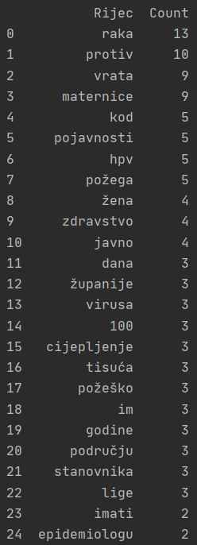

 

 

__March__

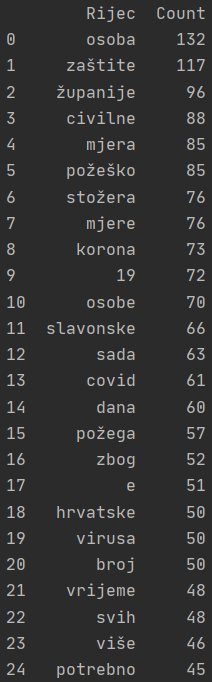

 

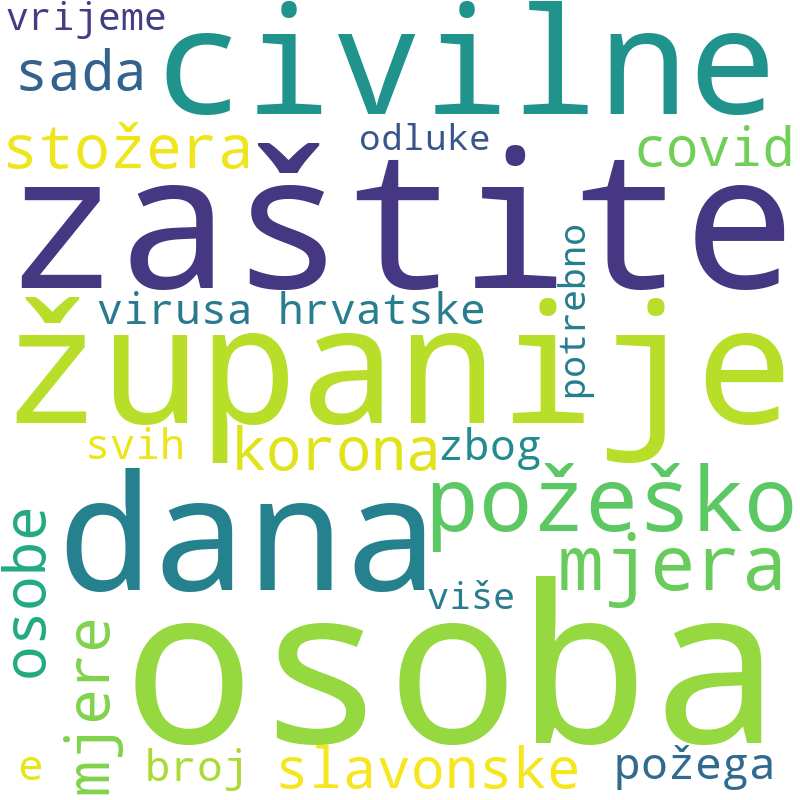

 

__April__

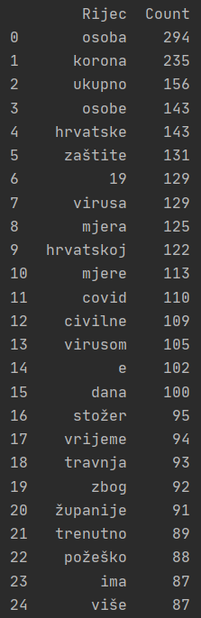

 

 

__May__

 

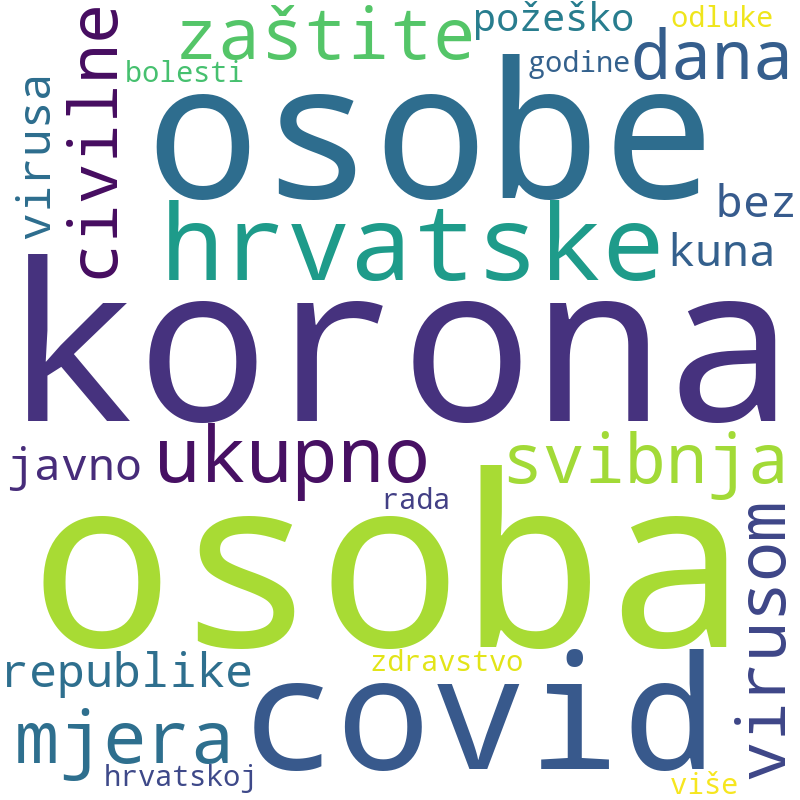

 

__June__

 

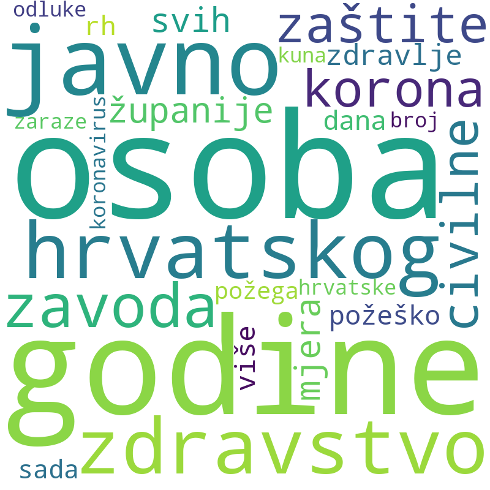

 

__July__

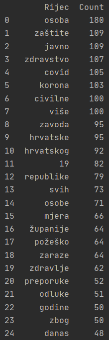

 

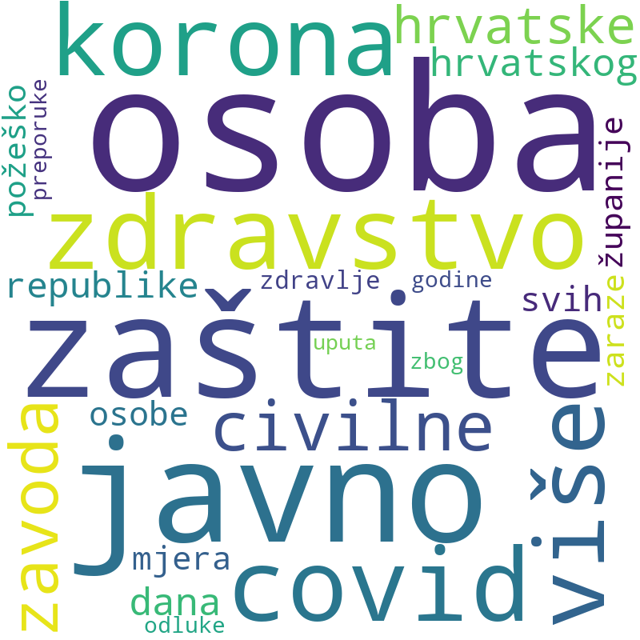

 

__August__

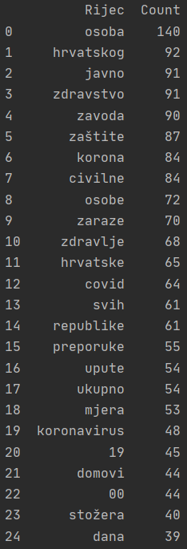

 

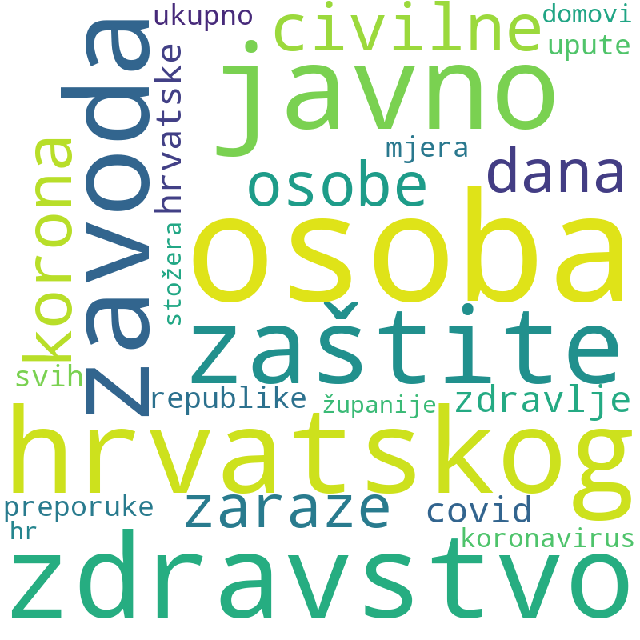

 

__September__

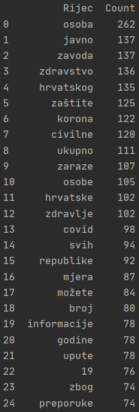

 

 

__October__

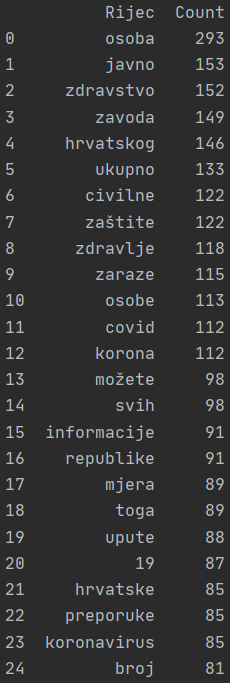

 

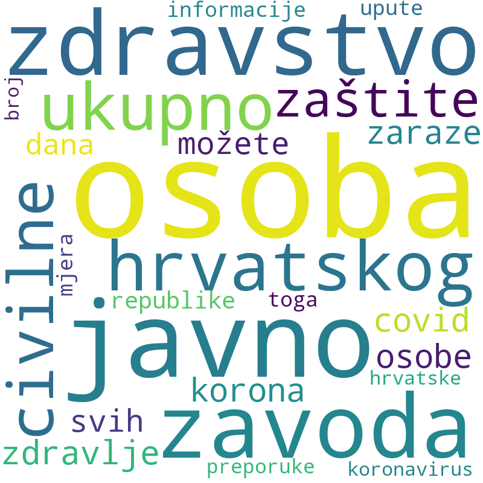

 

__November__

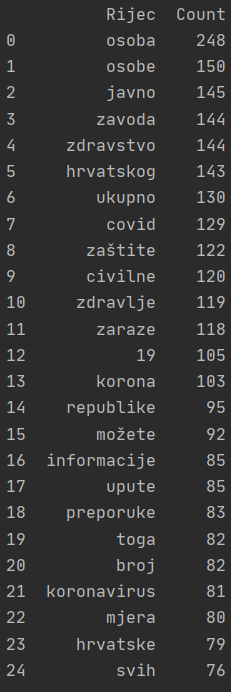

 

 

