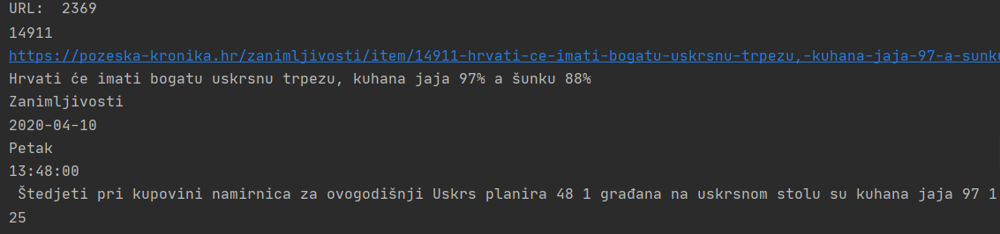

# __Covid 19 in media__

This project was made as a part of a course called Knowledge Management (Upravljanje znanjem). 

<b>Faculty:</b> Department of Informatics, University of Rijeka

<b>Author:</b>
* Lucija Veljačić
  
<b>Mentor:</b>
* izv. prof. dr. sc. Ana Meštrović
  
<b>Programming language:</b> Python 3

## Description

The purpose of this project is to analyze data collected from a Croatian web portal  [Požeška kronika](https://pozeska-kronika.hr) and to generate new knowledge based on this data.

The __first part__ of the project focuses on collecting and cleaning data from the web portal. After scraping, the data is saved to a .csv file for future use in the second part of the project.

The goal of the __second part__ of the project is to analyze the collected data in regards to the current pandemic of Covid-19.  The analysis of the articles provided an insight into the presence of Covid-19 in the media.

  
### Požeška kronika - Homepage

 

### Technical information

__OS:__ Windows 10

__Tools and software:__
* PyCharm
* Python 3.8

__Packages:__
* requests (2.25.1)
* bs4 (0.0.1)
* regex (2021.4.4)
* pandas (1.2.4)
* tabulate (0.8.9)
* matplotlib (3.4.2)
* nltk (3.6.2)
* wordcloud (1.8.1)

## Phase 1 - Web scraping

### Script __UPZ_PK0.py__

The script collects unique URLs from the web portal for the period from __1.1.2020. to 30.11.2020.__ and stores them in the file __url_list.txt__.

Web portal has __8 categories__:
* Economy
* Politics
* Self-government
* Crime&Accidents
* Culture
* Society
* Sport
* Interesting facts

Function __get_links__ is called for each category of the portal separately and it goes through pages containing the short overview of the articles (10 articles per page), starting from the newest page and stopping when it finds an article written before 1.1.2020. For a URL to be stored in the list of URLs, it must meet the condition that it is from 2020 and that it was not written in December, since the analysis is performed until the end of November. The final list of URLs has 2433 records. 

When executing the code, the script prints the number of pages it has opened for each category and the number of articles from the page that meet the condition of being published between 1.1.2020. and 30.11.2020. It also prints the total number of URLs after each page and the current category, and prints it. 

### Script __UPZ_PK1.py__

The next script __UPZ_PK1.py__ uses a previously created file storing URLs to get the list of URLs. The script opens each URL and scrapes the article ID, URL, title, category, date, day, and time of publishing, as well as article text and number of votes (number of people who reacted to the article).

Collected data and corresponding headers are stored in a file __podaci.csv__.  Initially, only the headers are stored, and then the data for each article is stored separately, as a row, as the script goes through the list of URLs. At the end, the data from the .csv file is read and stored to a .json file with the same name.

The format of the collected data can be seen in the following image.

 

## Phase 2 - Analysis

### Script __UPZ_PK2.1.py__

 
